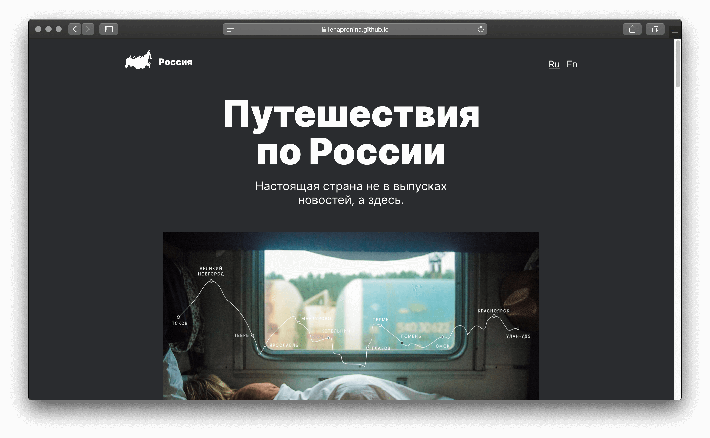

# Путешествие по России

Путешествие по России – проектная работа по адаптивной вёрстке в курсе веб-разработчик от Яндекс.Практикум. Ее цель научиться использовать инструменты создания интерфейсов под разные устройства.

Работа над этим проектом включает в себя освоение таких практик как:
* Работа с макетами в Figma
* Особености подключения шрифтов и оптимизация картинок
* Относительные величины, функция calc() для создания адаптивности
* Медиазапросы для задания свойств различным экранам
* PixelPerfect – плагин, который лишит сна и приблизит вёрстку к идеальной
* Публикация проекта на GitHubPages

**Используемые технологии**

HTML · CSS · Flexbox · Grid-layout · BEM · Nested BEM · Git · GitHubPages
